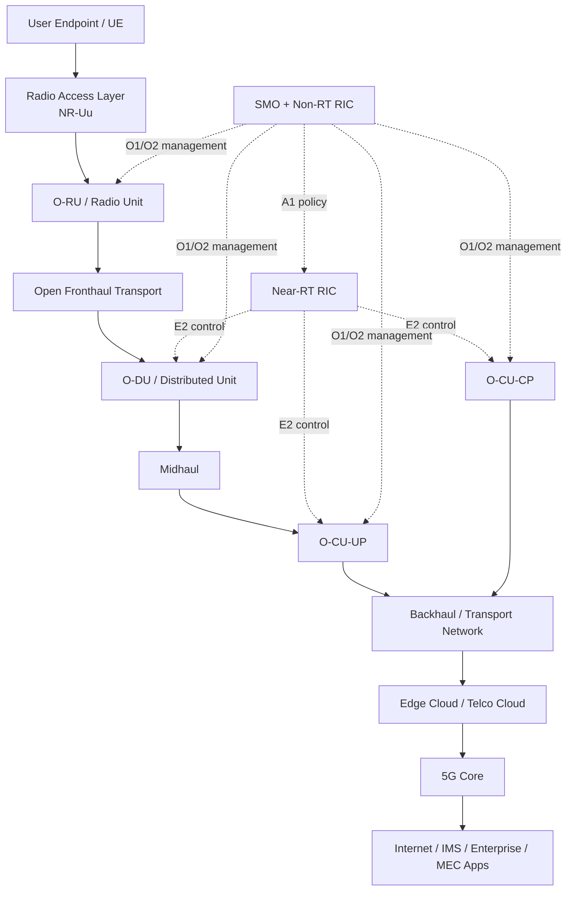
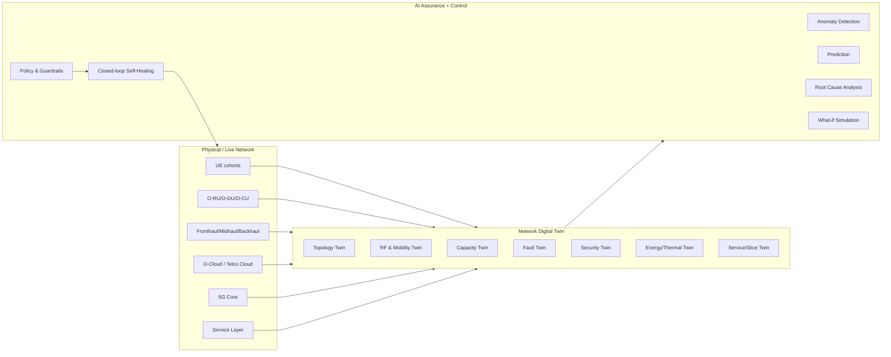
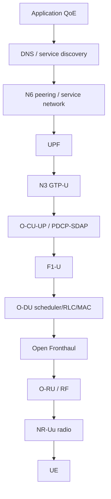
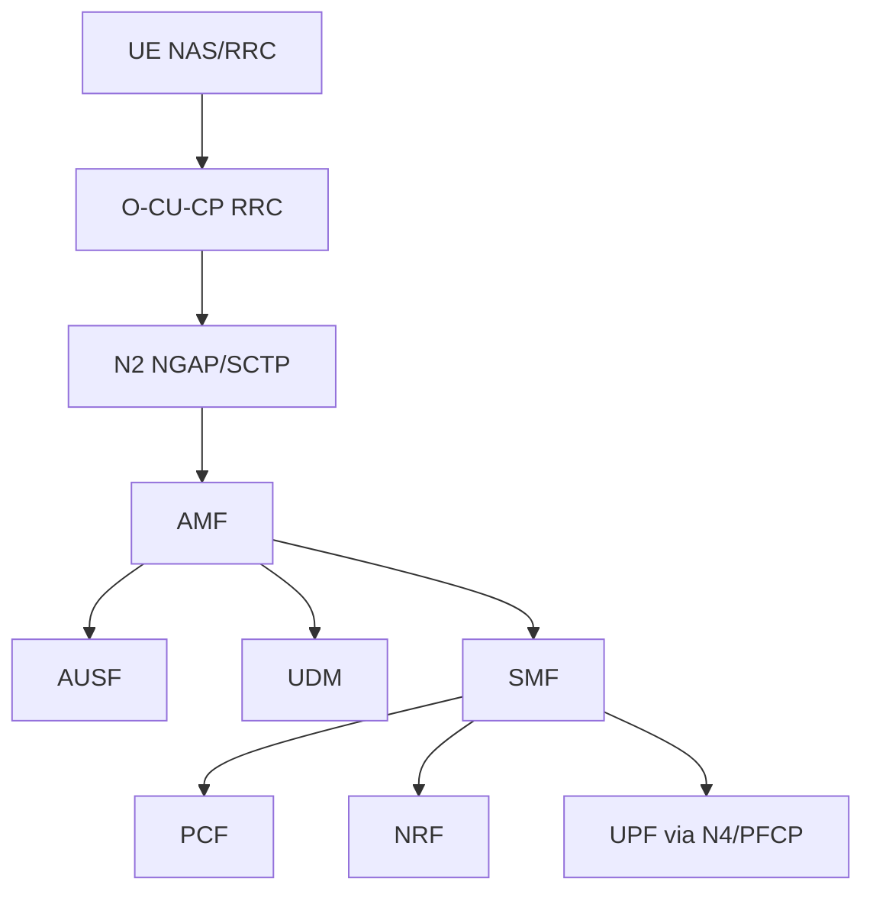
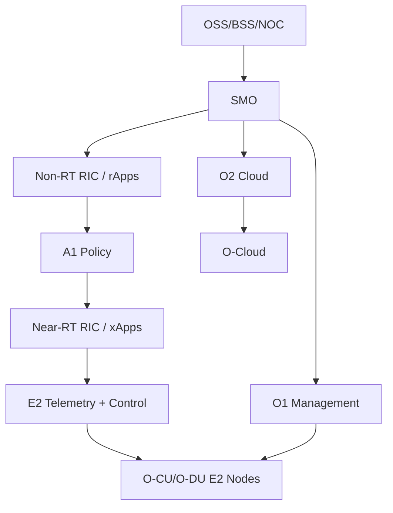

# AI-Native Self-Healing O-RAN Network Using a Digital Twin

## Scope

This document decomposes a national-scale 5G/O-RAN communication path from a user endpoint to the core network and service layer. It is written for architecture and literature-survey work, not implementation.

The target product concept is a telecom-grade Digital Twin + AI NOC platform that detects, predicts, and helps heal network faults across RAN, transport, edge/cloud, and 5G Core domains.

## Standards Baseline

| Domain | Main standards / bodies | Why it matters |
|---|---|---|
| 5G system architecture | 3GPP TS 23.501, TS 23.502 | Defines UE, RAN, 5GC, SBA, PDU sessions, mobility, network slicing, N1/N2/N3/N4/N6/N9. |
| NG-RAN architecture | 3GPP TS 38.300, TS 38.401 | Defines gNB, CU/DU split, NG, Xn, F1, E1 and NG-RAN functions. |
| 5G security | 3GPP TS 33.501 | Defines 5G-AKA/EAP-AKA', SUCI/SUPI, NAS/AS security, SBA security, inter-PLMN security. |
| O-RAN architecture | O-RAN WG1 architecture, ETSI TS 103 982 PAS | Defines SMO, Non-RT RIC, Near-RT RIC, O-CU, O-DU, O-RU, A1, O1, O2, E2, Open Fronthaul. |
| O-RAN control loops | O-RAN A1, E2, O1, R1, AI/ML workflow specs | Enables rApps/xApps, policy, telemetry, and RAN optimization loops. |
| Digital twin network | ITU-T Y.3090, ETSI ZSM DTN work | Defines network digital twin concepts, data collection, twin modeling, simulation, and closed-loop management. |
| Autonomous networks | ETSI ZSM, TM Forum autonomous networks | Provides NOC automation, assurance, policy, closed-loop, and intent-driven operation patterns. |
| Transport | IEEE 802.1, IEEE 1588 PTP, SyncE, IETF IP/MPLS/SRv6/IPsec/TLS | Required for fronthaul/midhaul/backhaul latency, timing, routing, and security. |
| Near-future 6G | ITU IMT-2030, early 3GPP Rel-19/Rel-20 direction | AI-native air interface, sensing, NTN, semantic communications, integrated compute, and deeper native network twins. |

## End-to-End Hierarchy

## Service Category Abstraction

| Service category | Typical endpoints | Dominant requirement | Digital twin modeling focus |
|---|---|---|---|
| eMBB | Phones, tablets, AR/VR, laptops | Throughput and mobility | SINR, PRB use, handovers, scheduler pressure, cell-edge throughput, QoE. |
| mMTC | Sensors, meters, industrial tags | Scale, low power, cheap access | Random access load, paging load, attach storms, battery-aware traffic, signaling congestion. |
| URLLC | Industrial control, robotics, critical operations | Reliability and low latency | Packet delay budget, retransmissions, deterministic transport, edge placement, redundancy. |
| FWA | Home/enterprise routers | Sustained capacity and availability | Sector load, beam quality, weather impact, CPE alignment, backhaul capacity. |
| V2X | Vehicles, RSUs, infrastructure | Mobility, low latency, local awareness | Handover risk, sidelink/PC5, edge breakout, location/time synchronization, corridor coverage. |

## Layer-by-Layer Decomposition

### 1. User Endpoint / UE

Role: Originates and consumes service traffic. Performs radio access, NAS registration, authentication, mobility procedures, QoS flow handling, and application traffic exchange.

Standards: 3GPP TS 23.501, TS 24.501, TS 38.300, TS 38.331, TS 33.501, TS 38.101.

Protocols: NAS, RRC, SDAP, PDCP, RLC, MAC, PHY, IP, TCP/UDP/QUIC, TLS, application protocols.

Data movement: Application packets are mapped to QoS flows, encapsulated through SDAP/PDCP/RLC/MAC/PHY and transmitted over NR-Uu. Control signaling uses NAS and RRC.

Next layer communication: Wireless NR-Uu radio interface to gNB/O-RU through beams, carriers, slots, PRBs, modulation, coding, and MIMO layers.

Bottlenecks: Poor RF conditions, device category limits, battery saving state transitions, thermal throttling, antenna blockage, weak uplink, application congestion.

Security vulnerabilities: Rogue base station downgrade attempts, device firmware compromise, SIM/eSIM provisioning weaknesses, location leakage, weak app-layer security, jamming exposure.

Latency sources: RRC idle-to-connected transition, scheduling wait, HARQ retransmissions, poor SINR, uplink grant delay, TCP slow start, DNS/TLS setup.

Telemetry: RSRP, RSRQ, SINR, CQI, MCS, BLER, HARQ retransmissions, RRC state, attach/registration failures, throughput, app QoE, battery state, location, mobility path.

Failures: SIM/auth failure, radio link failure, attach failure, paging miss, PDU session failure, device category mismatch, poor RF, app failure.

AI-detectable failures: Abnormal attach failures by device/service group, radio link failure clusters, QoE degradation by region, device firmware anomaly, signaling storms.

AI-predictable failures: Battery-related IoT dropout, FWA CPE degradation due to alignment/weather trends, mobility corridor handover failures, cell-edge QoE degradation before complaints.

### 2. Radio / NR Air Interface

Role: Converts endpoint data into physical radio transmission over licensed/shared spectrum.

Standards: 3GPP NR PHY/MAC/RLC/PDCP/RRC series, spectrum regulation by national regulator, 3GPP TS 38.300.

Protocols: NR PHY, MAC, RLC, PDCP, RRC, beam management, HARQ, CSI reporting.

Data movement: Bits become transport blocks, mapped onto physical channels and transmitted via OFDM symbols, slots, beams, carriers, and MIMO layers.

Next layer communication: Wireless waveform between UE and O-RU antennas. Control channels carry synchronization, random access, scheduling, and broadcast information.

Bottlenecks: Spectrum scarcity, interference, PRB exhaustion, beam collision, pilot contamination, TDD configuration, uplink coverage, weather for mmWave/FWA.

Security vulnerabilities: Jamming, spoofing synchronization/broadcast signals, RF fingerprint leakage, unauthorized passive monitoring of unencrypted control metadata, location inference.

Latency sources: Slot duration, scheduling periodicity, retransmissions, beam sweeping, random access contention, TDD uplink/downlink switching, propagation.

Telemetry: Cell load, PRB utilization, SINR heatmaps, interference/noise floor, BLER, CQI, beam failure recovery, random access attempts, paging attempts, RLF reports.

Failures: Interference, coverage hole, random access overload, beam failure, high BLER, synchronization failure, uplink power limitation.

AI-detectable failures: Interference pattern detection, coverage holes, abnormal BLER, random access storms, beam instability, uplink/downlink imbalance.

AI-predictable failures: Congestion by time/event/location, seasonal/weather mmWave degradation, interference onset from trend signatures, mobility-induced beam failure zones.

### 3. O-RU / Radio Unit

Role: Handles RF transmission/reception, low-PHY functions depending on split option, digital-to-analog conversion, power amplification, antenna arrays, beamforming hardware, and timing-sensitive radio functions.

Standards: O-RAN Open Fronthaul, O-RAN WG4, 3GPP NR radio requirements, IEEE 1588 PTP, SyncE.

Protocols: eCPRI, O-RAN Open Fronthaul C/U/S/M planes, PTP, SyncE, Ethernet, VLAN, NETCONF/YANG for management in many deployments.

Data movement: Receives IQ/user-plane radio samples and control instructions from O-DU; transmits RF. Receives RF uplink and sends digitized uplink samples to O-DU.

Next layer communication: Wired fronthaul Ethernet/fiber to O-DU using Open Fronthaul/eCPRI.

Bottlenecks: Fronthaul bandwidth, timing accuracy, RU CPU/FPGA limits, power amplifier saturation, antenna faults, thermal stress.

Security vulnerabilities: Fronthaul exposure, weak management credentials, firmware supply-chain risk, timing manipulation, rogue RU attachment, physical tampering.

Latency sources: RF processing, packetization, fronthaul serialization, timing recovery, beamforming processing, queueing in fronthaul switches.

Telemetry: RU temperature, PA power, VSWR, optical power, PTP lock state, SyncE state, eCPRI packet loss/jitter, antenna branch health, beam counters, Tx/Rx power.

Failures: RU hardware failure, PA degradation, antenna branch failure, PTP loss, SyncE instability, fiber loss, packet loss, overheating, firmware crash.

AI-detectable failures: Thermal anomaly, PA drift, antenna branch imbalance, timing instability, fronthaul packet-loss pattern, RU reboot loops.

AI-predictable failures: Fan/thermal failure, optical degradation, PA aging, antenna water ingress signatures, clock instability trend.

### 4. Open Fronthaul Transport

Role: Carries time-critical traffic between O-RU and O-DU for disaggregated RAN.

Standards: O-RAN Open Fronthaul, IEEE Ethernet, IEEE 1588 PTP, SyncE, IEEE 802.1CM time-sensitive networking where used.

Protocols: eCPRI over Ethernet, UDP/IP in some profiles, PTP, SyncE, VLAN/QoS, LACP where applicable.

Data movement: User-plane IQ-like payloads, control-plane scheduling/beam instructions, synchronization, and management traffic flow over fiber/Ethernet.

Next layer communication: Wired fiber/Ethernet to O-DU fronthaul interface.

Bottlenecks: Strict latency/jitter budget, oversubscription, packet loss, queueing, timing distribution, switch buffer pressure.

Security vulnerabilities: L2 spoofing, VLAN hopping, exposed management plane, PTP spoofing/delay attacks, physical fiber tapping, misconfigured ACLs.

Latency sources: Switch hops, serialization, queueing, PTP instability, congestion, retransmission at upper layers where applicable.

Telemetry: Link utilization, dropped frames, eCPRI sequence gaps, one-way delay, jitter, PTP offset, SyncE quality level, optical levels, queue depth.

Failures: Fiber cut, bad optic, clock drift, VLAN misconfig, switch congestion, MTU mismatch, packet reordering, timing failure.

AI-detectable failures: Microburst congestion, timing anomaly, optic degradation, recurrent packet gaps, path instability.

AI-predictable failures: Optical power deterioration, congestion before peak hours, timing grandmaster instability, link failure based on error-rate trends.

### 5. O-DU / Distributed Unit

Role: Hosts real-time lower RAN functions: RLC, MAC, high-PHY, scheduling, HARQ control, and part of radio resource management.

Standards: 3GPP TS 38.401, TS 38.473 F1AP, O-RAN O-DU specs, O-RAN E2 service models.

Protocols: F1-U, F1-C/F1AP, E2AP, E2SM, Open Fronthaul/eCPRI, GTP-U on F1-U, SCTP for F1-C/E2, management through O1.

Data movement: Receives uplink radio data from O-RU, performs MAC/RLC/high-PHY processing, forwards user-plane packets to CU-UP and control events to CU-CP. Receives scheduling and control from CU and RIC.

Next layer communication: Wired midhaul to O-CU using F1-C and F1-U; E2 to Near-RT RIC; O1 to SMO.

Bottlenecks: Scheduler overload, CPU acceleration limits, high PRB use, HARQ load, F1 bottleneck, fronthaul timing pressure.

Security vulnerabilities: E2/xApp control abuse, O1 credential compromise, container escape if virtualized, malformed protocol messages, supply-chain risk.

Latency sources: Scheduler processing, HARQ timing, RLC retransmission, CPU contention, virtualization overhead, midhaul queueing.

Telemetry: PRB utilization, scheduler latency, HARQ stats, RLC buffer occupancy, MAC throughput, active UEs, random access stats, F1 latency, CPU/accelerator use.

Failures: DU crash, scheduler stall, overload, fronthaul desync, F1 reset, cell outage, acceleration card failure, bad xApp policy impact.

AI-detectable failures: Scheduler anomaly, DU CPU saturation, overload cascades, F1 reset patterns, misbehaving policy effects, abnormal RACH/BLER correlation.

AI-predictable failures: DU overload before event peaks, accelerator thermal throttling, scheduler queue buildup, cell outage risk from fronthaul/RU precursor metrics.

### 6. Midhaul / F1 Transport

Role: Carries split-gNB traffic between O-DU and O-CU.

Standards: 3GPP F1 interface, IP/Ethernet/MPLS/SRv6 transport practices, timing and QoS standards.

Protocols: F1-C over SCTP/F1AP, F1-U over GTP-U/UDP/IP, IPsec/MACsec/TLS depending operator security design, routing protocols.

Data movement: Control-plane DU-CU coordination and user-plane tunnel traffic between DU and CU-UP.

Next layer communication: Wired packet transport to O-CU.

Bottlenecks: GTP-U tunnel congestion, SCTP association instability, MTU fragmentation, routing asymmetry, QoS misclassification.

Security vulnerabilities: Tunnel spoofing, route hijack, weak segmentation, unencrypted internal links, DDoS on SCTP/control plane.

Latency sources: Queueing, routing path stretch, encapsulation overhead, congestion, jitter buffers, firewall inspection.

Telemetry: F1 setup/reset events, SCTP retransmissions, GTP-U loss/jitter, path latency, route changes, queue drops, MTU errors.

Failures: SCTP failure, F1 reset, GTP-U loss, route blackhole, firewall/ACL change, packet fragmentation.

AI-detectable failures: Midhaul congestion, asymmetric loss, unstable SCTP associations, route flapping, QoS marking errors.

AI-predictable failures: Capacity exhaustion, route instability, tunnel loss trend, congestion from scheduled traffic/events.

### 7. O-CU-CP / O-CU-UP

Role: O-CU-CP manages RRC, mobility, F1-C, E1, and N2 signaling. O-CU-UP handles PDCP user plane, SDAP, GTP-U user-plane tunneling, and QoS flow mapping.

Standards: 3GPP TS 38.401, TS 38.463 E1AP, TS 38.413 NGAP, TS 29.281 GTP-U, O-RAN O-CU specs.

Protocols: RRC, PDCP, SDAP, F1AP/F1-U, E1AP, NGAP over SCTP, GTP-U, E2AP/E2SM, O1 management.

Data movement: CU-CP handles UE context, mobility, sessions, and signaling to AMF. CU-UP terminates F1-U and forwards user-plane GTP-U toward UPF over N3.

Next layer communication: N2 control-plane to AMF, N3 user-plane to UPF, Xn to neighboring gNBs, E2 to RIC, O1 to SMO.

Bottlenecks: CU-UP throughput, PDCP buffering, N3 tunnel pressure, CU-CP signaling storms, handover context load, CPU/memory limits.

Security vulnerabilities: Control-plane message abuse, GTP-U spoofing, weak NF segmentation, RIC policy misuse, management API exposure.

Latency sources: PDCP processing, CU-UP queueing, handover processing, N2 signaling delays, N3 path latency, virtualization overhead.

Telemetry: RRC failures, handover success/failure, PDCP discard/reordering, GTP-U throughput/loss, N2/N3 latency, CU CPU/memory, UE contexts.

Failures: CU-UP crash, CU-CP overload, failed handovers, N2/N3 tunnel failure, PDCP buffer overflow, E1 failure between CU-CP and CU-UP.

AI-detectable failures: Handover anomaly, CU saturation, N3 degradation, PDCP discard spikes, session setup anomalies.

AI-predictable failures: Signaling storm risk, CU-UP saturation, handover failure clusters, N3 bottleneck, mobility degradation by corridor.

### 8. Near-RT RIC

Role: Executes near-real-time RAN control loops, typically 10 ms to 1 s, through xApps. Optimizes mobility, interference, load balancing, QoS, energy, and slicing behavior.

Standards: O-RAN Near-RT RIC architecture, E2AP, E2 service models, A1 interface.

Protocols: E2AP over SCTP, E2SM-KPM, E2SM-RC, E2SM-NI and other service models, A1 policy/enrichment, platform APIs.

Data movement: Receives RAN telemetry and state over E2; sends control actions/policies to E2 nodes; receives higher-level guidance from Non-RT RIC over A1.

Next layer communication: E2 to O-CU/O-DU; A1 to Non-RT RIC; internal APIs to xApps.

Bottlenecks: xApp inference latency, E2 telemetry volume, conflicting xApps, policy arbitration, platform scaling, stale state.

Security vulnerabilities: Malicious xApp, model poisoning, unauthorized RAN control, leakage of UE/RAN data, weak app isolation, E2 spoofing.

Latency sources: Telemetry collection, xApp inference, policy conflict resolution, E2 transport delay, control actuation delay.

Telemetry: xApp decisions, policy outcomes, E2 indication rates, KPM counters, control acknowledgements, model confidence, policy conflicts.

Failures: xApp crash, bad policy, E2 association loss, model drift, overload, conflicting control loops.

AI-detectable failures: Model drift, bad control-action effect, conflicting xApps, anomalous E2 telemetry, degraded policy outcome.

AI-predictable failures: Control-loop instability, xApp overload, model staleness, policy conflict under expected traffic change.

### 9. SMO + Non-RT RIC

Role: Performs service management and orchestration, non-real-time optimization, policy generation, AI/ML training workflow, rApp hosting, and lifecycle management. Typical control loop is above 1 s and can span minutes/hours.

Standards: O-RAN SMO, O1, O2, A1, R1, ETSI NFV/MANO alignment, ETSI ZSM concepts.

Protocols: O1 management, NETCONF/YANG, REST/gRPC depending implementation, A1, R1, O2 cloud infrastructure APIs, telemetry/event buses.

Data movement: Aggregates telemetry from RAN and cloud; trains/updates models; sends policies/enrichment to Near-RT RIC; manages lifecycle and configuration of O-RAN functions.

Next layer communication: A1 to Near-RT RIC, O1 to O-RAN network functions, O2 to cloud infrastructure, northbound APIs to OSS/BSS/NOC.

Bottlenecks: Data lake scale, telemetry quality, policy approval workflow, model training compute, orchestration delays, multi-vendor schema mismatch.

Security vulnerabilities: Centralized management compromise, model poisoning, API credential leakage, misconfiguration blast radius, supply-chain risk.

Latency sources: Data ingestion delay, batch analytics, model training, approval gates, orchestration actuation time.

Telemetry: Configuration state, alarms, performance counters, inventory, topology, model lifecycle, policy history, SLA/SLO status, trouble-ticket correlation.

Failures: Wrong configuration, failed rollout, stale topology, model drift, telemetry gaps, orchestration failure, policy rollback failure.

AI-detectable failures: Misconfiguration pattern, alarm storms, topology mismatch, model drift, policy-performance regression, multi-domain incident correlation.

AI-predictable failures: Capacity exhaustion, energy/fan failure, traffic hotspots, SLA breach, fiber/optic degradation, model decay, rollout risk.

### 10. Backhaul / IP Transport

Role: Carries user-plane and control-plane traffic from RAN/CU sites to edge/core sites.

Standards: IETF IP/MPLS/SRv6, IEEE Ethernet, 3GPP N2/N3/N6/N9 use, IPsec/MACsec where required.

Protocols: IP, MPLS, SR-MPLS/SRv6, BGP, IS-IS/OSPF, RSVP-TE or segment routing, QoS, GTP-U, SCTP, IPsec, MACsec.

Data movement: N2 signaling to AMF, N3 GTP-U to UPF, Xn inter-gNB traffic, operations and telemetry traffic.

Next layer communication: Wired fiber/microwave packet network to edge/core data centers.

Bottlenecks: Link saturation, route churn, QoS misconfiguration, peering constraints, microwave weather fade, transport oversubscription.

Security vulnerabilities: Route hijack, DDoS, exposed management, weak control-plane policing, unencrypted internal traffic, BGP/IGP misconfiguration.

Latency sources: Path stretch, queueing, congestion, firewall/NAT traversal, microwave hops, route convergence.

Telemetry: Interface counters, queue drops, jitter, latency, route changes, BGP/IGP events, tunnel health, QoS class utilization, optical power.

Failures: Fiber cut, routing loop, BGP flap, MPLS label issue, SR policy error, packet loss, congestion, DDoS.

AI-detectable failures: Route anomaly, microbursts, DDoS, congestion, correlated fiber cuts, QoS misclassification.

AI-predictable failures: Capacity exhaustion, optic degradation, microwave fade risk, route instability, SLA breach.

### 11. Edge Cloud / Telco Cloud

Role: Hosts virtualized/containerized RAN functions, UPFs, MEC apps, observability stack, AI inference, and orchestration platforms.

Standards: ETSI NFV, Kubernetes/CNCF practices, O-RAN O-Cloud/O2, 3GPP edge/UPF placement concepts.

Protocols: O2 APIs, Kubernetes APIs, CNI/CSI, gRPC/REST, VXLAN/Geneve, SR-IOV, DPDK, PTP for timing-sensitive workloads.

Data movement: Network functions process packets and control-plane events; telemetry is streamed to observability and twin systems; orchestration changes resource placement.

Next layer communication: Wired fabric to 5GC NFs, UPF, RAN functions, and external data networks.

Bottlenecks: CPU pinning, NUMA placement, NIC queueing, DPDK limits, storage I/O, east-west fabric congestion, accelerator availability.

Security vulnerabilities: Container escape, insecure images, weak RBAC, exposed APIs, lateral movement, secrets leakage, shared infrastructure side channels.

Latency sources: Virtual switch path, CPU scheduling, noisy neighbors, storage latency, service mesh overhead, cross-zone placement.

Telemetry: CPU, memory, NIC drops, pod restarts, PTP state, NUMA locality, DPDK drops, service latency, node health, image versions.

Failures: Node crash, pod crashloop, NIC failure, storage failure, PTP loss, resource exhaustion, bad deployment, control-plane failure.

AI-detectable failures: Noisy neighbor impact, pod crash loops, resource leakage, abnormal latency, deployment regression.

AI-predictable failures: Node saturation, storage exhaustion, NIC degradation, workload placement risk, thermal/fan issues.

### 12. 5G Core Network

Role: Provides mobility, session management, authentication, policy, charging, subscriber data, slicing, and user-plane forwarding.

Standards: 3GPP TS 23.501, TS 23.502, TS 29-series SBI specs, TS 33.501 security.

Protocols: N1 NAS, N2 NGAP/SCTP, N3/N9 GTP-U, N4 PFCP, SBI HTTP/2 REST with TLS, OAuth2-style authorization profiles, Diameter where interworking exists, DNS, NRF discovery.

Data movement: AMF handles access/mobility; SMF creates PDU sessions and programs UPF using PFCP; UPF forwards user packets to data networks; PCF/UDM/AUSF/NRF/NSSF/CHF support policy, auth, discovery, slicing, and charging.

Next layer communication: N6 from UPF to Internet/enterprise/IMS/MEC; SBI among core NFs; N2/N3 toward RAN.

Bottlenecks: AMF signaling load, SMF session setup, UPF throughput, NRF discovery delay, DNS, SBI latency, database bottlenecks, policy/charging latency.

Security vulnerabilities: SBA API exposure, token misuse, weak mTLS, DDoS on AMF/UPF, GTP-U spoofing, PFCP abuse, subscriber data leakage, roaming interface risk.

Latency sources: Registration, authentication, PDU session setup, policy lookup, UPF path length, NAT/firewall, service discovery, database access.

Telemetry: Registration success, PDU session success, N2/N3/N4/N6 latency, PFCP session counts, UPF throughput, SBI error rates, NF CPU/memory, slice SLA, auth failures.

Failures: AMF overload, SMF failure, UPF crash, PFCP failure, NRF failure, UDM/AUSF failure, DNS failure, slice isolation failure, charging/policy failure.

AI-detectable failures: Signaling storm, auth anomaly, UPF congestion, SBI error burst, slice SLA breach, NF dependency failure, DNS/NRF instability.

AI-predictable failures: AMF/SMF overload, UPF capacity exhaustion, database saturation, slice SLA breach, roaming storm, policy bottleneck.

### 13. Internet / IMS / Enterprise / MEC Service Layer

Role: Delivers the actual user service: public internet, voice/video over IMS, enterprise private networks, cloud apps, MEC apps, V2X services, IoT platforms.

Standards: IETF Internet standards, IMS/VoNR 3GPP specs, MEC ETSI specs, enterprise VPN and cloud standards.

Protocols: IP, TCP/UDP/QUIC, DNS, TLS, HTTP/2/3, SIP/RTP for IMS, IPsec/GRE/VXLAN for enterprise, MQTT/CoAP for IoT.

Data movement: UPF sends and receives packets over N6; application paths may breakout locally at edge or traverse central internet peering.

Next layer communication: Wired N6/peering/private interconnect/cloud connectivity.

Bottlenecks: DNS, peering congestion, CDN path, NAT/firewall state, app server latency, IMS media path, enterprise gateway limits.

Security vulnerabilities: DDoS, DNS hijack, TLS misconfiguration, API abuse, bot traffic, SIP fraud, enterprise VPN compromise.

Latency sources: Internet path, peering, DNS, TLS handshake, app processing, congestion control, NAT/firewall inspection.

Telemetry: DNS latency, HTTP errors, RTT, packet loss, CDN performance, IMS call setup success, MOS, app QoE, N6 throughput.

Failures: DNS outage, CDN issue, peering failure, IMS failure, app outage, enterprise gateway failure, DDoS.

AI-detectable failures: QoE degradation, DNS anomaly, DDoS, IMS call failure clusters, app-specific latency degradation.

AI-predictable failures: Peering congestion, CDN degradation, traffic surge, DDoS risk pattern, app saturation.

## Connection / Interface Matrix

| Connection | Interface | Protocols | Medium | Data exchanged | Encryption / integrity | Major failure points |
|---|---|---|---|---|---|---|
| UE to gNB/O-RU | NR-Uu | PHY/MAC/RLC/PDCP/RRC/NAS | Wireless | User data, RRC, NAS, radio measurements | 5G AKA establishes keys; NAS and AS security protect signaling/user plane per policy; app TLS may protect payload | Poor SINR, jamming, RACH overload, RLF, paging failure, device issue |
| O-RU to O-DU | Open Fronthaul | eCPRI, O-RAN C/U/S/M planes, PTP, SyncE | Wired fiber/Ethernet | IQ/user-plane samples, control, sync, management | Often physically isolated; MACsec/IPsec possible; management secured via SSH/TLS/NETCONF depending deployment | Timing loss, fiber/optic fault, packet loss, VLAN/QoS error, RU fault |
| O-DU to O-CU | F1 | F1-C/F1AP over SCTP, F1-U over GTP-U/UDP/IP | Wired packet midhaul | UE context, control procedures, user-plane tunnels | IPsec/MACsec/TLS may be used by operator security policy; SCTP/GTP usually in protected domain | SCTP reset, GTP-U loss, MTU mismatch, congestion, misrouting |
| O-CU-CP to O-CU-UP | E1 | E1AP over SCTP | Wired/internal DC or transport | Bearer/session split control, CU-UP selection/control | Usually protected domain; may use IPsec/MACsec where separated | E1 association failure, CU-UP unavailable, scaling mismatch |
| gNB to gNB | Xn | XnAP over SCTP, Xn-U GTP-U | Wired backhaul | Mobility, handover context, dual connectivity, user forwarding | Operator-domain encryption, IPsec/MACsec as needed | Xn unavailable, handover failures, route latency, version mismatch |
| O-CU/gNB to AMF | N2 | NGAP over SCTP | Wired backhaul | Registration, mobility, session control, UE context | Network-domain protection; SBA side uses TLS; IPsec possible on transport | SCTP failure, AMF overload, NGAP errors, route/firewall issue |
| O-CU-UP/gNB to UPF | N3 | GTP-U/UDP/IP | Wired backhaul | User-plane tunnel packets | Payload may be app encrypted; transport-domain IPsec/MACsec possible; 5G user-plane ciphering may apply over radio leg | GTP-U loss, UPF unreachable, congestion, tunnel mismatch |
| SMF to UPF | N4 | PFCP over UDP/IP | Wired core/control network | UPF session rules, QoS, forwarding rules, usage reporting | Protected control network; IPsec possible; access control critical | PFCP timeout, stale rules, UPF overload, SMF failure |
| UPF to data network | N6 | IP, TCP/UDP/QUIC, DNS, TLS, SIP/RTP, enterprise VPN | Wired peering/private/cloud | Internet/IMS/enterprise/MEC traffic | Mostly application-layer TLS/IPsec; operator edge controls | Peering congestion, DNS failure, DDoS, NAT/firewall state exhaustion |
| UPF to UPF | N9 | GTP-U | Wired core transport | User-plane tunnel between UPFs | Operator-domain encryption as needed | Anchor change failure, tunnel loss, path stretch |
| Non-RT RIC to Near-RT RIC | A1 | A1 policy/enrichment APIs | Wired management/control | Policies, enrichment info, ML model guidance | TLS/mTLS, authorization, policy validation | Bad policy, stale enrichment, API failure, policy conflict |
| Near-RT RIC to O-CU/O-DU | E2 | E2AP/E2SM over SCTP | Wired control | KPM telemetry, control subscriptions, RAN control actions | Secure transport and app authorization required; xApp isolation critical | E2 association loss, bad xApp, delayed control, model drift |
| SMO to O-RAN NFs | O1 | NETCONF/YANG, REST/gRPC depending profile, telemetry streams | Wired management | Config, fault, performance, inventory, software lifecycle | TLS/SSH, RBAC, audit, secrets management | Credential issue, config drift, telemetry gap, failed rollout |
| SMO to O-Cloud | O2 | Cloud infrastructure APIs | Wired management | Resource inventory, deployment, lifecycle, infrastructure telemetry | TLS/mTLS, cloud RBAC, workload identity | Cloud API failure, capacity shortage, bad placement, node failure |
| rApps to Non-RT RIC | R1 | O-RAN R1 APIs | Wired/platform internal | Non-real-time analytics, optimization, policy proposals | Platform auth, sandboxing, model governance | Bad rApp, weak isolation, model poisoning |

## Digital Twin System Map

### What Should Exist Inside the Digital Twin

| Twin object | Needed fidelity | Purpose |
|---|---|---|
| Topology graph | Site, cell, sector, RU, DU, CU, transport links, cloud nodes, 5GC NFs, service dependencies | Root cause, blast-radius analysis, dependency-aware healing. |
| RF/cell model | Coverage, SINR, interference, beams, PRBs, mobility corridors | Detect coverage/interference issues and simulate parameter changes. |
| Traffic model | eMBB/mMTC/URLLC/FWA/V2X demand by time/location/slice | Forecast congestion and stress-test capacity. |
| Protocol/session model | RRC, NAS, PDU sessions, handovers, N2/N3/N4 tunnels | Correlate failures across control/user plane. |
| Transport model | Links, routes, QoS classes, latency/jitter/loss, timing | Predict and detect path/timing bottlenecks. |
| Cloud resource model | Pods/VMs, NUMA, CPU, NIC, storage, accelerators, PTP | Explain virtualized RAN/core performance anomalies. |
| Security model | Assets, trust zones, identities, APIs, xApps/rApps, policy permissions | Detect attack paths and unsafe automation. |
| Energy/thermal model | RU power, DU/CU/cloud power, HVAC, temperature, fan status | Predict hardware failure and optimize energy. |
| SLA/slice model | Slice topology, QoS flows, S-NSSAI, service KPIs | Service-aware RCA and monetizable assurance reporting. |

### What Should Be Simulated

| Simulation area | Example scenarios |
|---|---|
| RF and mobility | Handover parameter changes, new site planning, coverage holes, V2X corridor movement, mmWave/FWA weather impact. |
| Traffic and slice demand | Stadium surge, IoT attach storm, enterprise SLA growth, URLLC peak load, FWA evening peak. |
| Transport | Fiber cut, route convergence, QoS queue pressure, PTP grandmaster failure, microwave fade. |
| Cloud/RAN workload | DU/CU scaling, UPF relocation, noisy neighbor impact, accelerator failure, patch rollout. |
| Core network | AMF overload, SMF/UPF scaling, NRF failure, DNS failure, PDU session storm. |
| Security | Rogue xApp, API credential compromise, DDoS, GTP-U spoofing, management-plane compromise. |
| Closed-loop actions | Cell tilt/power change, neighbor relation update, traffic steering, xApp rollback, UPF failover, route change. |

### What Should Be Monitored

| Domain | Monitoring priority |
|---|---|
| UE cohorts | QoE, attach/registration, RRC failures, device/service category behavior. |
| Radio | PRB, SINR, CQI, BLER, RACH, beam failures, handover, interference. |
| RU/fronthaul | PTP/SyncE, eCPRI loss/jitter, optical power, RU thermal/power/antenna. |
| DU/CU | Scheduler latency, RLC/PDCP buffers, F1/E1/N2/N3 health, CPU/accelerator. |
| RIC/SMO | Policy changes, xApp/rApp behavior, model version, E2/A1/O1/O2 health. |
| Transport | Link loss/jitter, route changes, QoS queues, optical metrics, DDoS. |
| Cloud | Node/pod health, NIC drops, CPU pinning, NUMA, PTP, storage. |
| Core | AMF/SMF/UPF/NRF/UDM/AUSF/PCF health, SBI errors, PFCP, GTP-U, slice KPIs. |
| Service layer | DNS, CDN, IMS, enterprise app, N6, peering, QoE. |

### Where to Apply Anomaly Detection

Highest-value anomaly detection domains:

1. Radio interference and coverage degradation.
2. RACH/signaling storms from mMTC or faulty device firmware.
3. Fronthaul timing and packet loss.
4. DU/CU scheduler and buffer anomalies.
5. Handover failure clusters.
6. RIC policy/xApp abnormal impact.
7. Transport route, jitter, and QoS anomalies.
8. UPF throughput, PFCP, and GTP-U anomalies.
9. SBA API error bursts and NF dependency failures.
10. Cross-domain SLA degradation before customer complaints.

### Where to Apply Predictive Maintenance

Best prediction candidates:

1. RU power amplifier degradation.
2. Antenna branch imbalance or water ingress.
3. Optical link degradation.
4. PTP/SyncE clock instability.
5. DU/CU/cloud node thermal or resource exhaustion.
6. UPF capacity exhaustion.
7. Transport congestion during known events.
8. FWA weather-related degradation.
9. Mobility corridor handover risk.
10. Model drift and policy degradation.

### Where to Apply Automated Self-Healing

| Self-healing area | Realistic automated action | Required guardrail |
|---|---|---|
| RAN congestion | Load balancing, traffic steering, scheduler parameter adjustment | Slice/SLA constraint and rollback. |
| Handover failures | Neighbor relation correction, handover threshold tuning | Mobility KPI safety check. |
| Interference | Power/tilt/PCI/beam policy adjustment where supported | RF simulation before actuation. |
| RU/fronthaul issue | Fail over path, isolate RU, shift load to neighbor cells | Avoid coverage collapse. |
| Timing issue | Switch timing source, quarantine unstable clock domain | PTP holdover validation. |
| DU/CU overload | Scale workload, move CU-UP, adjust traffic steering | Cloud resource and latency constraint. |
| Bad xApp/rApp | Disable/rollback app or policy | Signed app, approval, audit trail. |
| Transport congestion | Reroute, QoS correction, SR policy update | Loop prevention and SLA validation. |
| UPF failure | UPF failover, session re-anchor where supported | Session continuity and lawful intercept constraints. |
| Core NF overload | Scale NF, rate-limit signaling, redirect traffic | Policy and subscriber impact controls. |

## Dependency Trees

### User-Plane Dependency Tree

### Control-Plane Dependency Tree

### O-RAN Automation Dependency Tree

## AI Realism Boundary

AI can realistically detect and predict statistical, correlated, and trend-based failures when telemetry is reliable and labeled incidents exist. AI is weaker when failures are instantaneous, externally caused, or hidden from instrumentation.

High realism:

- Congestion prediction.
- Interference detection.
- RF degradation trend detection.
- Optical degradation prediction.
- DU/CU/UPF resource saturation.
- Handover anomaly detection.
- Alarm correlation and RCA.
- Bad rollout / bad xApp impact detection.

Medium realism:

- Exact root cause for multi-vendor protocol bugs.
- User-device firmware failure attribution.
- Security attack classification without packet/log context.
- Predicting rare disaster events.

Low realism:

- Predicting sudden fiber cuts with no precursor.
- Predicting abrupt power outage without facility telemetry.
- Predicting zero-day exploit behavior without security signals.
- Fully autonomous healing without policy guardrails in safety-critical slices.

## NOC Productization View

To keep the project application-based and monetizable, frame the system as an AI-native telecom assurance and autonomous operations platform:

1. National topology twin: multi-vendor, multi-domain asset and dependency graph.
2. Service assurance twin: maps network behavior to eMBB/mMTC/URLLC/FWA/V2X customer impact.
3. Predictive maintenance module: RU, optics, timing, transport, cloud, and UPF risk scoring.
4. AI RCA engine: correlates radio, transport, cloud, and core alarms into incident narratives.
5. Closed-loop healing controller: recommends, simulates, approves, executes, and rolls back actions.
6. Compliance/security cockpit: model governance, xApp/rApp trust, audit trail, and zero-trust control.
7. Executive SLA dashboard: monetizable reporting for operators, enterprises, smart cities, and private 5G owners.

## Literature Sources Downloaded Locally

See `literature-survey/LITERATURE_INDEX.md` for local file names, URLs, and why each source is useful.

